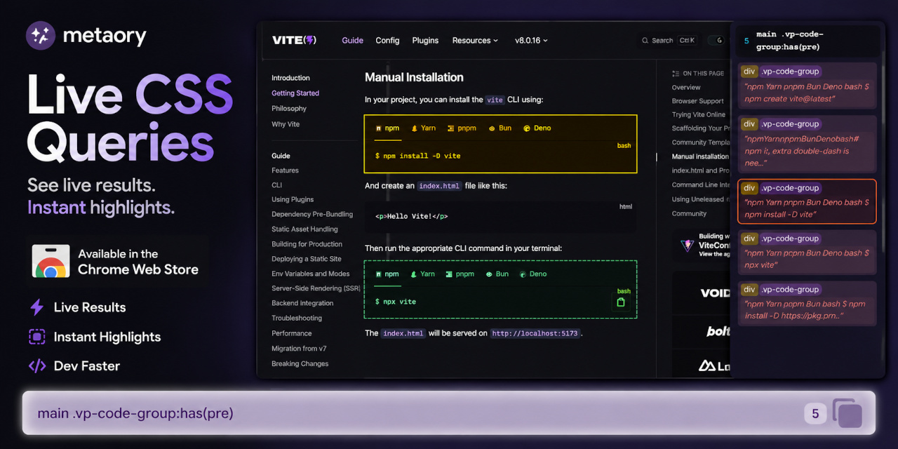

  
  <h1>Live CSS Queries</h1>
  
  
<strong>See live CSS selector results with instant highlights</strong>

  
Inspect matches in a narrow on-page panel while you refine selectors in place

---

## Why

Selector work on a real DOM is iterative; most DevTools flows are one-shot.

### Existing approaches and their pain points

| Approach | Limitation |
|---|---|
| DevTools → **Add style rule** (e.g. `border: 1px solid red`) | Fragile scratch test; DOM edits/typo reset work. No match count/list. |
| DevTools Console → `document.querySelectorAll(...)` | No on-page marks; grind through `NodeList` in Elements. Re-type each pass. |
| Inspect → **Copy selector / XPath** | Deep paths; unstable auto-generated `id`s on framework remount. Rarely ship-ready. |

### Core problems

- **Volatile ids** · copied selectors often break across framework remounts.
- **Brittle paths** · generated chains ≠ the query you maintain in CSS/JS tests.
- **Single-shot tooling** · little on-page iterate → tighten loop without leaving the DOM.

## What it does

Docked bottom input:

- Highlights on each keystroke; match panel lists tag, id, classes, attrs, text snippet (**150** listed, **500** highlighted cap).
- Row click → scroll + focus; row hover → active highlight on page.
- Invalid selectors → inline error; prior state intact until corrected.
- Copy selector via docked button or **Ctrl/Cmd+C** when the input has no selection.
- **Escape** clears a non-empty input and focuses it; when empty, deactivates the tool. Works globally while the tool is open.

## Install

**Chrome Web Store** — link TBD after publish.

**Unpacked (development)**

- Chrome → `chrome://extensions`
- Enable **Developer mode**
- **Load unpacked** → select this directory

## Usage

`chrome://extensions/shortcuts` · **toolbar icon** (Live CSS Queries)

| Action | Shortcuts label | Default |
| --- | --- | --- |
| Live CSS Queries | Toggle Live CSS Queries | Toolbar — bind on Shortcuts |
| Toggle selector input | Toggle selector input | **Alt+S** |

Both commands toggle on/off (action or shortcut again closes the tool and clears the UI).

## Limits

- Match panel list cap **150**; highlight cap **500** (see above).

## Permissions

MV3: no special permissions. Content scripts inject via manifest `matches: <all_urls>` — no `host_permissions` key, but the store still asks you to justify broad page access. UI stays off until you toggle via action or **Alt+S**.

## Privacy

No data collection or off-device transmission. See [PRIVACY.md](PRIVACY.md).

## License

[MIT](LICENSE)
