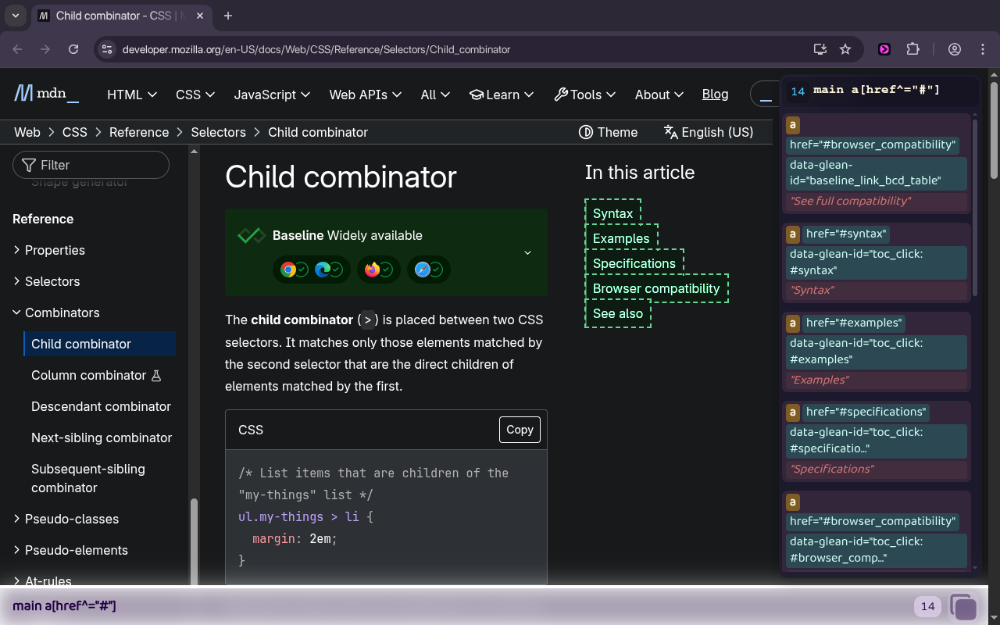

  
  <h1>Live CSS Queries</h1>
  
  
<strong>Live CSS selector results with on-page highlights</strong>

  
Type in the bottom input bar; inspect hits in the right-side match panel

---

## Why

You iterate selectors on the live DOM.

| Approach | Limitation |
|---|---|
| DevTools → **Add style rule** (e.g. `border: 1px solid red`) | Fragile scratch test; DOM edits reset work. No match count or list. |
| DevTools Console → `document.querySelectorAll(...)` | No on-page marks; re-type each pass. |
| Inspect → **Copy selector / XPath** | Deep paths; unstable auto-generated `id`s on framework remount. |

## What it does

- Docked bottom input highlights on each keystroke; match panel lists tag, id, classes, attrs, text snippet (**150** listed, **500** highlighted cap).
- Row click scrolls and focuses; row hover previews the active highlight.
- Invalid selectors show an inline error; prior state stays until you fix the query.
- Copy selector via docked button or **Ctrl/Cmd+C** when the input has no selection.
- **Escape** clears a non-empty input and focuses it; when empty, closes the tool.

## Install

**Chrome Web Store:** link TBD after publish.

**Unpacked (development)**

1. Chrome → `chrome://extensions`
2. Enable **Developer mode**
3. **Load unpacked** → select this directory

## Usage

`chrome://extensions/shortcuts` · **toolbar icon**

| Action | Shortcuts label | Default |
| --- | --- | --- |
| Live CSS Queries | Toggle Live CSS Queries | Toolbar: bind on Shortcuts |
| Toggle selector input | Toggle selector input | **Alt+S** |

## Permissions

MV3: no special permissions. Content scripts use `matches: <all_urls>` in the manifest. You open the tool from the toolbar or **Alt+S**.

## Privacy

No data collection or off-device transmission. See [PRIVACY.md](PRIVACY.md).

## License

[MIT](LICENSE)
